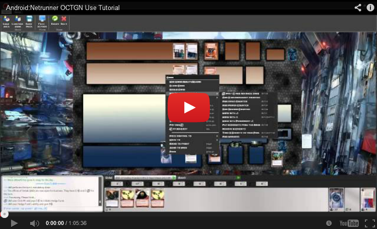

Android:Netrunner LCG plugin for OCTGN
=========================
Android: Netrunner is an asymmetrical cyberpunk Card Game for two players made by Fantasy Flight Games. 

*Set in a dystopian, cyberpunk future where monolithic megacorps own and control the vast majority of human interests. While corporation players try to score points by advancing their agendas, they have to guard their intellectual properties from the elite and subversive hackers known as netrunners.*

This is a game definition for the [Online Card and Tabletop Gaming Network (OCTGN)](http://octgn.net). Its card effects are almost completely automated to allow for smoother play and prevent mistakes

Enjoy!

Available Sets and Data Packs
---------

While you can play the game with the auto-generated proxies, if you've already memorized the cards, the censored images will allow you to play and recognise cards quicker.
Sets will be uncensored after 6 months.

* [Core](http://dbzer0.com/pub/ANR/Sets/ANR-Core.o8c)
* [What Lies Ahead](http://dbzer0.com/pub/ANR/Sets/ANR-What-Lies-Ahead.o8c) *(Censored)*
* [Trace Amount](http://dbzer0.com/pub/ANR/Sets/ANR-Trace-Amount.o8c) *(Censored)*
* [Cyber Exodus](http://dbzer0.com/pub/ANR/Sets/ANR-Cyber-Exodus.o8c) *(Censored)*
* [A Study In Static](http://dbzer0.com/pub/ANR/Sets/ANR-A-Study-In-Static.o8c) *(Censored)*
* [Humanity's Shadow](http://dbzer0.com/pub/ANR/Sets/ANR-Humanitys-Shadow.o8c) *(Censored)*
 

If you have the sets already from OCTGN 3.0 and you want to convert them to 3.1 without redownloading, [check this guide](o8c_Convert_Guide.md).

Tutorials
---------

Step-by-Step Tutorial Video *(Made in v2.1.11 so things have improved since then.)*

Other Links
---------
* [Official site](http://www.fantasyflightgames.com/edge_minisite_sec.asp?eidm=207&esem=1)
* [Plugin Forum](http://octgn.gamersjudgement.com/viewforum.php?f=52)
* [OCTGN Game Definition Changelog](changelog.md)
* [Online League](http://www.challengeboards.net/boards/details/4)
  
   

Screenshots
---------
(Click for larger size)

Wayland Corporation baits a criminal into a deadly ambush.

Kate Stealing the game from R&D.

Shaper running on a heavily fortifield Haas-Bioroid server.

